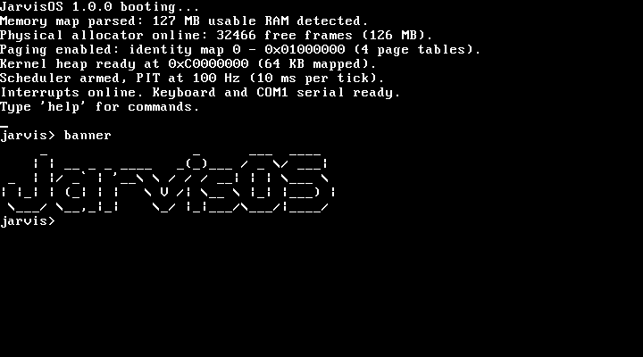
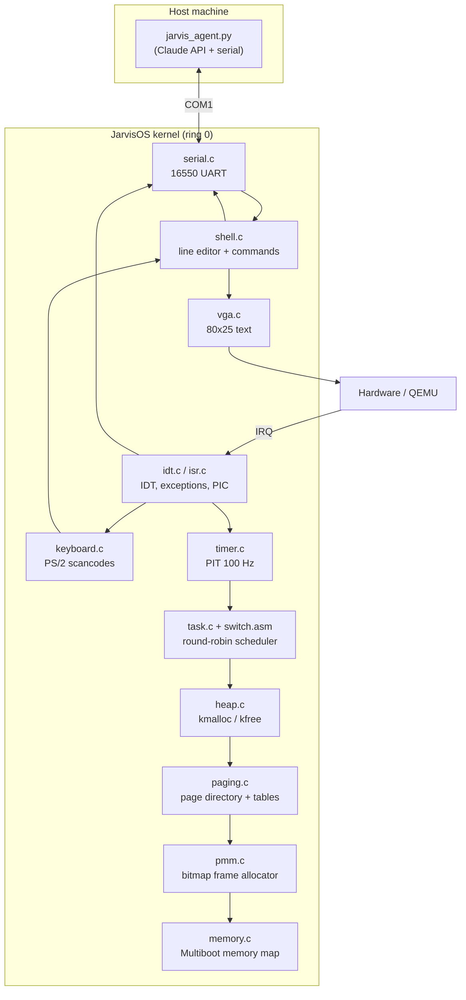
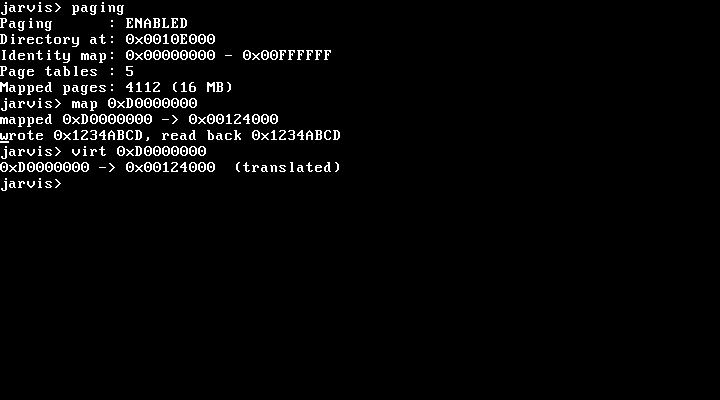
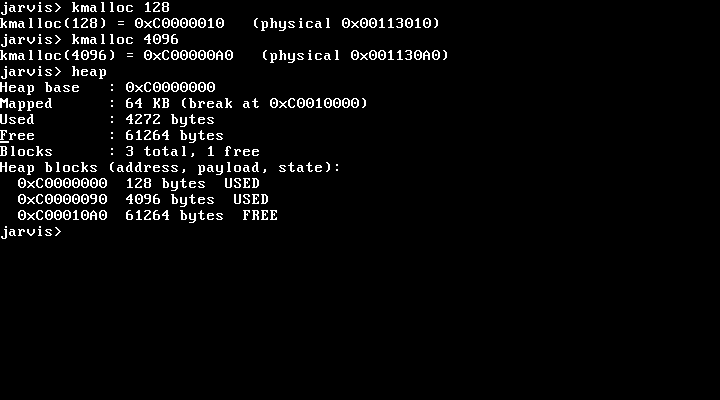
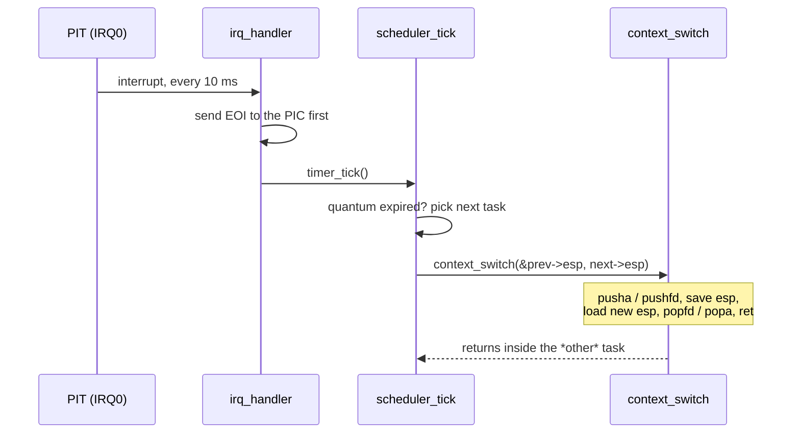
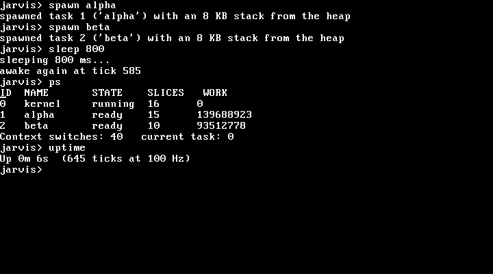
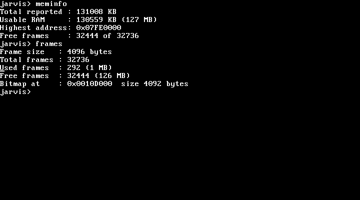
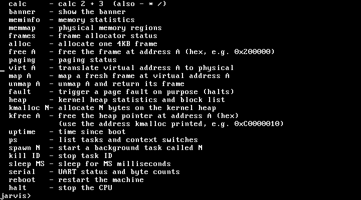
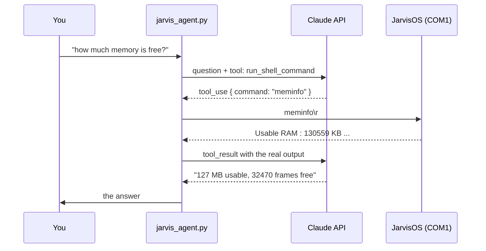

# JarvisOS

A small 32-bit x86 operating system written from scratch in C and assembly — no
standard library, no external kernel code. It boots from GRUB/Multiboot, drives
the screen and keyboard directly, manages physical and virtual memory, runs
preemptive tasks, and talks over a serial port. A Python agent on the host can
drive the whole thing in plain English through that serial port.



Every screenshot in this README is a real VGA framebuffer dump from QEMU,
captured by `tools/screenshot.py`.

---

## What it does

| Subsystem | Status | What's implemented |
|---|:--:|---|
| Boot | ✅ | Multiboot header, GRUB handoff, stack setup, `kernel_main` |
| VGA text driver | ✅ | 80×25 text, cursor tracking, scrolling, backspace |
| Interrupts | ✅ | 256-entry IDT, 32 CPU exception handlers, PIC remap, IRQ dispatch |
| Keyboard | ✅ | PS/2 scancode → ASCII, shift, backspace |
| Serial (UART) | ✅ | 16550 on COM1, all console output mirrored, IRQ4 receive |
| Shell | ✅ | Line editor, 25 commands, shared by keyboard and serial |
| Physical memory | ✅ | Multiboot memory map parsing, bitmap frame allocator |
| Paging | ✅ | Page directory + tables, 16 MB identity map, map/unmap/translate, page-fault handler |
| Kernel heap | ✅ | `kmalloc`/`kfree`, first-fit free list, splitting and coalescing, grows on demand |
| Timer + scheduler | ✅ | PIT at 100 Hz, preemptive round-robin, per-task kernel stacks |
| LLM agent | ✅ | Python host agent driving the shell over serial via the Claude API |

Not implemented: user mode (everything runs in ring 0), a filesystem, disk
drivers, or networking. See [Limitations](#limitations).

---

## Architecture



The dependency direction that matters: **the heap is built on paging, paging is
built on the frame allocator, and the frame allocator is built on what GRUB
told us about physical RAM.** Each layer only uses the one below it.

### Boot sequence

```mermaid
flowchart LR
    A["GRUB loads<br/>kernel at 1 MB"] --> B["boot.asm<br/>set up stack"]
    B --> C["serial_init"]
    C --> D["memory_init<br/>parse GRUB map"]
    D --> E["pmm_init<br/>build frame bitmap"]
    E --> F["paging_init<br/>identity map, CR0.PG"]
    F --> G["heap_init<br/>map heap at 0xC0000000"]
    G --> H["idt_install<br/>isr_install"]
    H --> I["scheduler_init<br/>timer_init"]
    I --> J["sti — interrupts on"]
    J --> K["shell loop"]
```



---

## Memory layout

```
0xFFFFFFFF  ┌──────────────────────────────────────────┐
            │  unmapped                                │
0xC0400000  ├──────────────────────────────────────────┤
            │  kernel heap ceiling (4 MB max)          │
0xC0000000  ├──────────────────────────────────────────┤  ← kmalloc lives here
            │  unmapped                                │
0x01000000  ├──────────────────────────────────────────┤  ← end of identity map
            │  free physical frames                    │
            │  page directory + page tables            │
            │  frame bitmap (1 bit per 4 KB frame)     │
0x00100000  ├──────────────────────────────────────────┤  ← kernel image (1 MB)
            │  low memory, BIOS                        │
0x000B8000  │  VGA text buffer                         │
0x00000000  └──────────────────────────────────────────┘
```

| Region | Address | Notes |
|---|---|---|
| Low memory | `0x00000000`–`0x000FFFFF` | BIOS areas; VGA text buffer at `0xB8000` |
| Kernel image | `0x00100000` | Loaded at 1 MB by GRUB; `kernel_end` from the linker script |
| Frame bitmap | after `kernel_end`, 4 KB aligned | 1 bit per frame — 1 KB per 32 MB of RAM |
| Page tables | from `pmm_alloc_frame()` | 1 directory + 4 tables to identity-map 16 MB |
| Identity map | `0x00000000`–`0x00FFFFFF` | Virtual == physical, so the kernel keeps working the instant paging turns on |
| Kernel heap | `0xC0000000`+ | Virtual only; backed by frames mapped in as the heap grows |

Paging is enabled with an identity map so that turning on the MMU doesn't move
the ground out from under the running kernel — the instruction after `mov cr0`
resolves to exactly the same physical address it did before.



`map 0xD0000000` allocates a physical frame, installs a page-table entry for it,
writes a magic value through the new virtual address, and reads it back — the
round trip proves the mapping is live.

---

## The kernel heap

`kmalloc` is a first-fit free list. Every allocation carries a 16-byte header
(magic, size, next, free flag), and the headers are kept in address order so two
neighbours in the list are also neighbours in memory — which makes coalescing a
size adjustment rather than a search.



Freeing both allocations merges all three blocks back into one, which you can
watch happen with `heap` before and after `kfree`.

The heap lives in virtual memory at `0xC0000000` and grows by asking the frame
allocator for physical pages and mapping them in — so it exercises the whole
memory stack at once.

---

## Preemptive multitasking

The PIT fires IRQ0 100 times a second. Every fifth tick the scheduler picks the
next runnable task and swaps stacks:



Two details make this work:

- **The PIC is acknowledged before the switch.** The timer handler may never
  return — it can walk off into another task's stack — and a missed end-of-interrupt
  would convince the controller IRQ0 was still in service, stopping every
  further tick.
- **A new task's crafted stack ends with `eflags = 0x202`.** The `popfd` in
  `context_switch` is what re-enables interrupts for a task entered for the
  first time, so it can be preempted like everything else.



The `WORK` column is each task's own counter loop. Watching those numbers pull
apart independently — while the shell stays responsive — is the proof that
preemption is real and not cooperative.

Task stacks are 8 KB `kmalloc`s, so `kill` returns them to the heap and the free
blocks coalesce back together.

---

## Physical memory



`memory.c` walks the memory map GRUB leaves behind and records every region.
`pmm.c` then builds a bitmap with one bit per 4 KB frame: it starts by marking
everything used, frees the regions GRUB reported as usable RAM, and finally
re-marks everything from address 0 through the end of the bitmap — which covers
low memory, the kernel image, and the bitmap itself in one sweep.

---

## Commands



| Command | What it does |
|---|---|
| `help`, `clear`, `echo X`, `about`, `version`, `banner` | Basics |
| `calc 2 + 3` | Integer arithmetic (`+ - * /`) |
| `meminfo`, `memmap`, `frames` | Memory statistics and the GRUB memory map |
| `alloc`, `free A` | Allocate / free one 4 KB physical frame |
| `paging` | Page directory address, identity range, table and page counts |
| `virt A` | Walk the page tables by hand and translate a virtual address |
| `map A`, `unmap A` | Map a fresh frame at a virtual address, or release it |
| `fault` | Touch unmapped memory on purpose to show the page-fault handler |
| `heap`, `kmalloc N`, `kfree A` | Kernel heap statistics and allocation |
| `uptime`, `ps`, `spawn N`, `kill ID`, `sleep MS` | Timer and scheduler |
| `serial` | UART status and byte counters |
| `reboot`, `halt` | Restart or stop the machine |

---

## Build and run

Requirements: `gcc` (with 32-bit support), `nasm`, `ld`, `qemu-system-i386`.

```bash
sudo apt install build-essential gcc-multilib nasm qemu-system-x86
```

```bash
make          # build kernel.bin
make run      # boot it in QEMU
make clean
```

To use the serial console instead of the graphical window:

```bash
qemu-system-i386 -kernel kernel.bin -m 128M -display none -serial stdio
```

Everything the OS prints appears in your terminal, and everything you type goes
to the same shell the keyboard drives.

### Regenerating the screenshots

```bash
python3 tools/screenshot.py           # all scenes into docs/img/
python3 tools/screenshot.py heap      # just one
```

It boots QEMU, types the scripted commands over the serial port, screendumps
the VGA framebuffer, and converts QEMU's PPM to PNG with nothing but `zlib`.

---

## The LLM agent

`agent/jarvis_agent.py` runs on the host, boots the OS, connects to COM1, and
hands Claude a single tool: *run a command in the JarvisOS shell*. Claude
chooses the commands, reads the real output, and answers from it.



```bash
pip install anthropic
export ANTHROPIC_API_KEY=sk-ant-...

python3 agent/jarvis_agent.py                       # interactive
python3 agent/jarvis_agent.py "is the heap fragmented?"
```

```
you> how much memory does this machine have?
[jarvis] meminfo
Claude: 127 MB of usable RAM. 32,444 of the 32,736 four-kilobyte frames
are still free, so almost nothing has been handed out yet.
```

Without an API key it drops into `--offline` mode, a small keyword matcher that
maps questions to commands — enough to demo the serial plumbing with no
network and no dependencies.

Useful flags: `--kernel`, `--memory`, `--port`, `--attach` (connect to a QEMU
you already started), `--offline`. The model can be changed with
`JARVIS_MODEL`.

---

## Project layout

```
boot.asm       Multiboot header, entry point, kernel stack
linker.ld      Load at 1 MB, export kernel_end
kernel.c       Boot sequence and the main loop
vga.c/.h       80x25 text driver (mirrors everything to serial)
serial.c/.h    16550 UART on COM1
keyboard.c/.h  PS/2 scancode decoding
idt.c/.h       Interrupt descriptor table
idt_load.asm   LIDT
isr.c/.h       Exception + IRQ handlers, PIC remap
isr.asm        32 exception stubs, 16 IRQ stubs, common trampolines
timer.c/.h     PIT at 100 Hz
task.c/.h      Task table, round-robin scheduler
switch.asm     The context switch itself
memory.c/.h    Multiboot memory map parsing
pmm.c/.h       Bitmap physical frame allocator
paging.c/.h    Page directory/tables, map/unmap/translate, page faults
heap.c/.h      kmalloc / kfree
shell.c/.h     Input ring buffer, line editor, commands
util.c/.h      strcmp, atoi, memset, and friends
multiboot.h    GRUB structures
io.h           inb / outb
agent/         Python LLM agent
tools/         Screenshot capture
```

---

## How it was built

| Stage | What landed |
|---|---|
| 1 | Multiboot header, boots and prints one string |
| 2 | VGA driver: newlines, cursor, scrolling |
| 3 | Split into modules with a Makefile |
| 4 | IDT, exception handlers, PIC remap, `sti` |
| 5 | PS/2 keyboard and an interactive shell |
| 6 | GRUB memory-map parsing (`meminfo`, `memmap`) |
| 7 | Bitmap physical frame allocator (`alloc`, `free`, `frames`) |
| 8 | 16550 UART: console mirroring and serial input |
| 9 | Paging: identity map, map/unmap/translate, page-fault handler |
| 10 | Kernel heap: `kmalloc`/`kfree` with splitting and coalescing |
| 11 | PIT + preemptive round-robin scheduler |
| 12 | Python LLM agent over the serial port |

---

## Limitations

Worth knowing before reading the code as a reference:

- **Ring 0 only.** There is no user mode, no `syscall` boundary, and no memory
  protection between tasks — every task can scribble on every other one.
- **No GDT of its own.** The kernel keeps using the flat segments GRUB installed.
- **The identity map is fixed at 16 MB**, so the machine needs at least that
  much RAM. Frames handed out above 16 MB have to be mapped before use.
- **No filesystem, disk, or network.** Nothing survives a reboot.
- **The frame allocator is a linear scan.** Fine at 128 MB; not at 128 GB.
- **`kill` is cooperative with the timer** — a dead task's stack is reclaimed on
  the next tick, once the scheduler has moved off it.

## License

MIT — do whatever you like with it.
